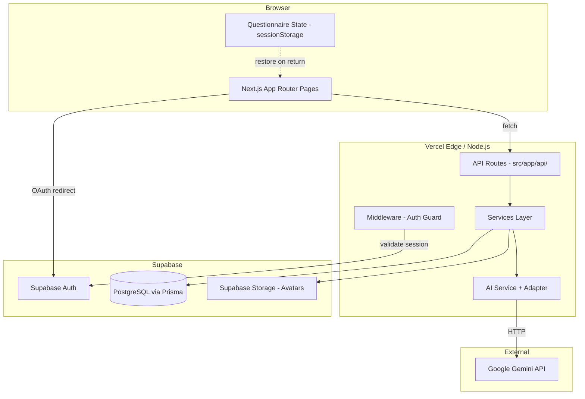
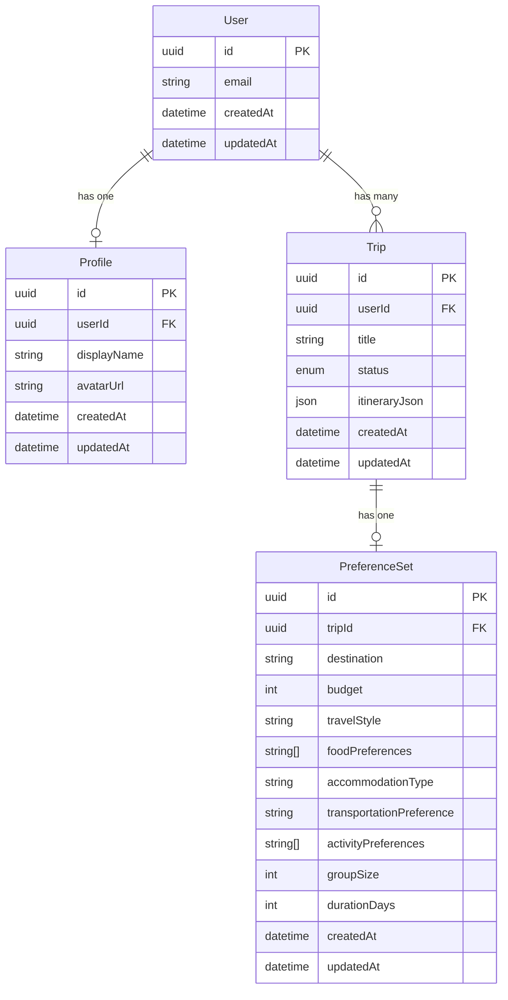
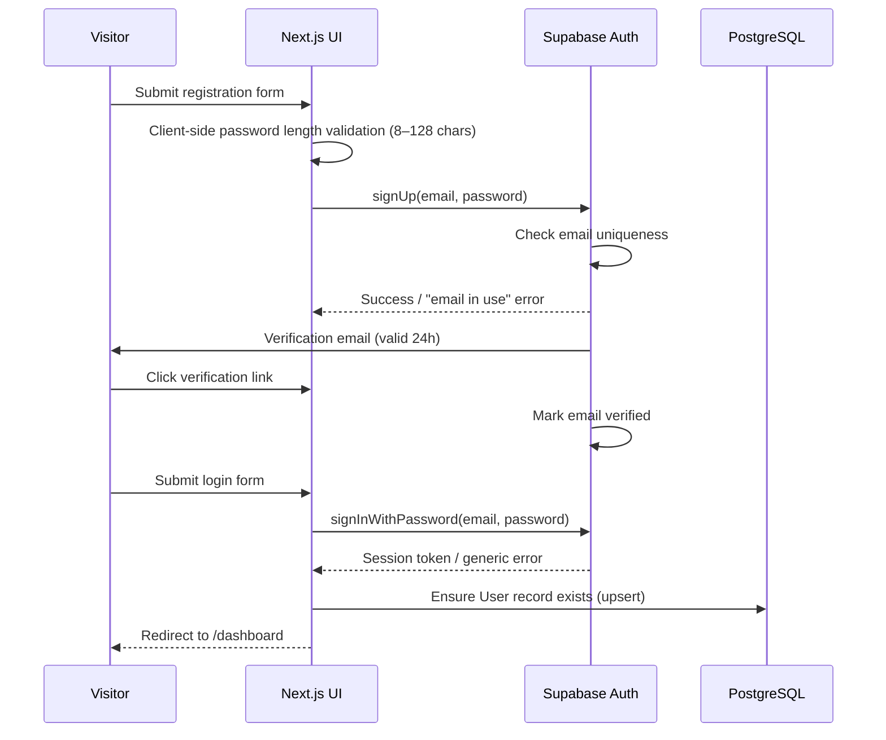
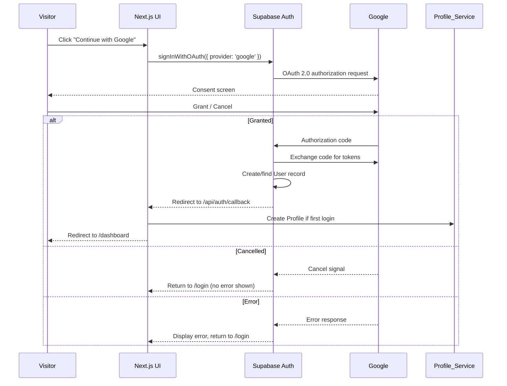
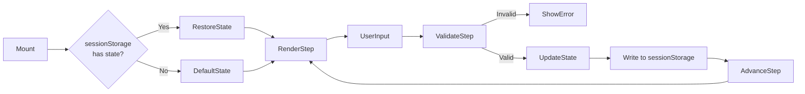
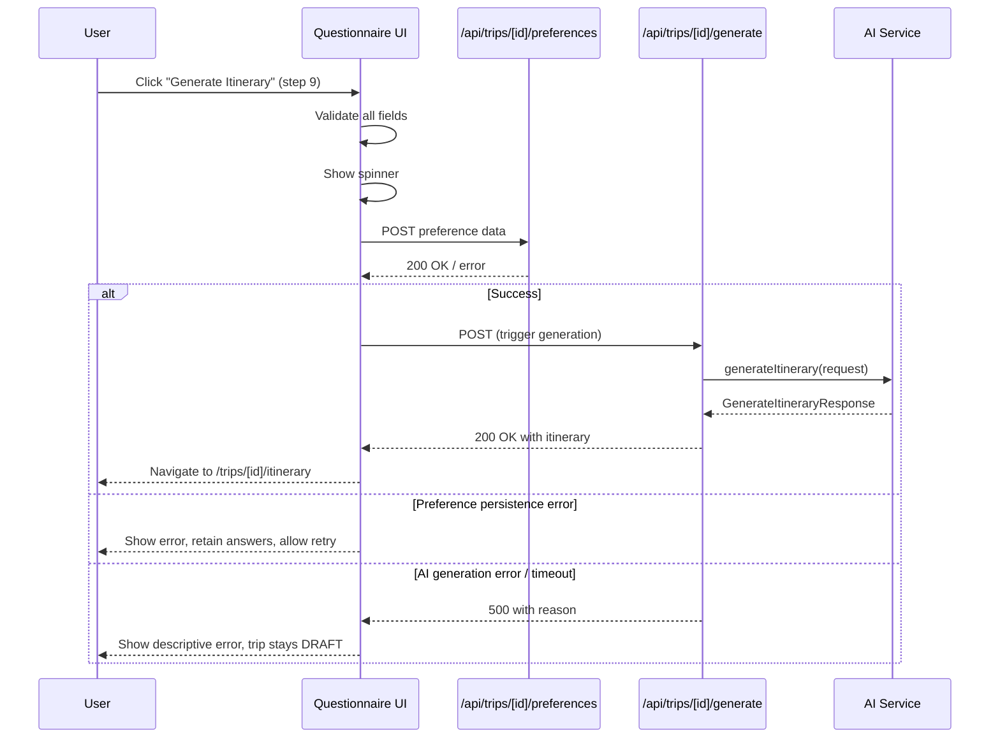
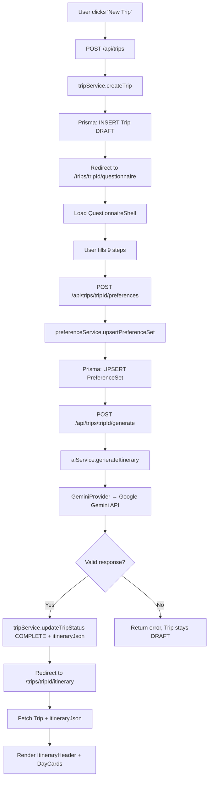
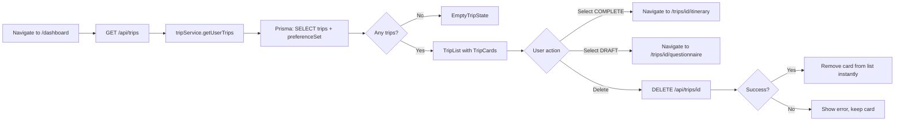

# Design Document: Roamly MVP

## Overview

Roamly is an AI-powered travel planning SaaS with the tagline "Plan Less. Explore More." Users answer a guided multi-step questionnaire about their travel preferences and receive a structured, day-by-day itinerary generated by an AI model. The MVP delivers user authentication (email/password + Google OAuth), profile management, trip creation, preference collection, AI itinerary generation, and trip persistence — without booking or payment features.

The architecture is built on **Next.js 14 App Router** with **TypeScript strict mode**, **Supabase PostgreSQL** via **Prisma ORM**, **Supabase Auth**, and an **Google Gemini**-backed AI layer wrapped in a provider-agnostic abstraction. All infrastructure is deployed on Vercel.

Key design goals:
- Clear separation of concerns between UI, API routes, services, and AI integration
- Provider-agnostic AI abstraction so future LLMs can be swapped via config
- Scalable folder architecture that maps cleanly to domain boundaries
- Type-safe end-to-end: from database models to API responses to React components

---

## Architecture

### High-Level Component Diagram



### Request Lifecycle

1. Browser navigates to a protected route → **Middleware** checks Supabase session cookie → redirects to `/login` if unauthenticated.
2. Authenticated pages call **API Routes** via `fetch`.
3. API Routes delegate to **Service modules** (one per domain entity).
4. Services query **Prisma** (PostgreSQL) or call **Supabase Storage** or invoke the **AI Service**.
5. AI Service resolves the active `AIProvider` adapter from env config and calls the external LLM.

---

## Folder Structure

```
src/
├── app/                          # Next.js App Router pages & layouts
│   ├── (auth)/
│   │   ├── login/page.tsx
│   │   └── register/page.tsx
│   ├── (protected)/
│   │   ├── dashboard/page.tsx
│   │   ├── profile/page.tsx
│   │   ├── trips/
│   │   │   ├── new/page.tsx
│   │   │   └── [tripId]/
│   │   │       ├── questionnaire/page.tsx
│   │   │       └── itinerary/page.tsx
│   ├── api/
│   │   ├── auth/
│   │   │   └── callback/route.ts       # OAuth callback handler
│   │   ├── profile/
│   │   │   └── route.ts                # GET, PATCH profile
│   │   ├── trips/
│   │   │   ├── route.ts                # GET (list), POST (create)
│   │   │   └── [tripId]/
│   │   │       ├── route.ts            # GET, DELETE trip
│   │   │       ├── preferences/route.ts
│   │   │       └── generate/route.ts
│   │   └── avatar/
│   │       └── route.ts                # POST avatar upload
│   ├── layout.tsx
│   └── page.tsx                        # Landing page
│
├── components/
│   ├── ui/                         # shadcn/ui primitives + wrappers
│   │   ├── Button.tsx
│   │   ├── Card.tsx
│   │   ├── Input.tsx
│   │   ├── Slider.tsx
│   │   ├── Stepper.tsx
│   │   ├── Chip.tsx
│   │   ├── Skeleton.tsx
│   │   └── Spinner.tsx
│   ├── layout/                     # App-wide layout chrome
│   │   ├── Navbar.tsx
│   │   ├── Sidebar.tsx
│   │   └── PageWrapper.tsx
│   └── features/                   # Domain-specific composite components
│       ├── auth/
│       │   ├── LoginForm.tsx
│       │   └── RegisterForm.tsx
│       ├── profile/
│       │   ├── ProfileCard.tsx
│       │   └── AvatarUpload.tsx
│       ├── trips/
│       │   ├── TripCard.tsx
│       │   ├── TripList.tsx
│       │   └── EmptyTripState.tsx
│       ├── questionnaire/
│       │   ├── QuestionnaireShell.tsx
│       │   ├── ProgressBar.tsx
│       │   └── steps/
│       │       ├── DestinationStep.tsx
│       │       ├── BudgetStep.tsx
│       │       ├── DurationStep.tsx
│       │       ├── GroupSizeStep.tsx
│       │       ├── TravelStyleStep.tsx
│       │       ├── AccommodationStep.tsx
│       │       ├── TransportationStep.tsx
│       │       ├── FoodStep.tsx
│       │       └── ActivitiesStep.tsx
│       └── itinerary/
│           ├── ItineraryHeader.tsx
│           ├── DayCard.tsx
│           └── ActivityItem.tsx
│
├── services/
│   ├── profileService.ts
│   ├── tripService.ts
│   └── preferenceService.ts
│
├── ai/
│   ├── types.ts                    # GenerateItineraryRequest/Response, AIProvider interface
│   ├── aiService.ts                # Provider resolution + invocation
│   ├── adapters/
│   │   └── GeminiProvider.ts
│   └── prompts/
│       └── itineraryPrompt.ts
│
├── db/
│   ├── schema.prisma
│   ├── client.ts                   # Prisma client singleton
│   └── seed.ts
│
├── hooks/
│   ├── useProfile.ts
│   ├── useTrips.ts
│   └── useQuestionnaire.ts
│
├── types/
│   ├── trip.ts
│   ├── profile.ts
│   ├── itinerary.ts
│   └── api.ts
│
├── lib/
│   ├── supabase/
│   │   ├── client.ts               # Browser Supabase client
│   │   └── server.ts               # Server Supabase client (cookies)
│   └── validations/
│       ├── profileValidation.ts
│       ├── tripValidation.ts
│       └── questionnaireValidation.ts
│
├── utils/
│   ├── formatDate.ts
│   ├── formatCurrency.ts
│   └── cn.ts                       # clsx + tailwind-merge helper
│
├── constants/
│   ├── routes.ts
│   ├── api.ts
│   └── questionnaire.ts
│
└── middleware.ts                    # Auth guard for protected routes
```

---

## Components and Interfaces

### Authentication Middleware

`src/middleware.ts` runs on the Vercel Edge runtime. It reads the Supabase session from the request cookies using the server-side Supabase client. Unauthenticated requests to any path under `/(protected)` or `/api/` (excluding `/api/auth/callback`) are redirected to `/login`.

```typescript
// Pseudocode — actual implementation in src/middleware.ts
export async function middleware(request: NextRequest) {
  const session = await getServerSession(request)
  const isProtected = PROTECTED_PATTERNS.some(p => p.test(request.nextUrl.pathname))
  if (isProtected && !session) {
    return NextResponse.redirect(new URL('/login', request.url))
  }
  return NextResponse.next()
}
```

### API Route Contracts

| Method | Path | Auth | Purpose |
|--------|------|------|---------|
| `GET` | `/api/profile` | Required | Get current user profile |
| `PATCH` | `/api/profile` | Required | Update displayName |
| `POST` | `/api/avatar` | Required | Upload avatar image |
| `GET` | `/api/trips` | Required | List user trips (sorted by createdAt desc) |
| `POST` | `/api/trips` | Required | Create new DRAFT trip |
| `GET` | `/api/trips/[tripId]` | Required | Get single trip |
| `DELETE` | `/api/trips/[tripId]` | Required | Delete trip (ownership check) |
| `POST` | `/api/trips/[tripId]/preferences` | Required | Persist PreferenceSet |
| `POST` | `/api/trips/[tripId]/generate` | Required | Trigger AI generation |
| `GET` | `/api/auth/callback` | None | Supabase OAuth redirect handler |

All protected routes return `403` when the session user does not own the requested resource.

### Service Interfaces

```typescript
// src/services/tripService.ts
interface TripService {
  createTrip(userId: string): Promise<Trip>
  getUserTrips(userId: string): Promise<TripWithPreferences[]>
  getTripById(tripId: string, userId: string): Promise<TripWithPreferences | null>
  deleteTrip(tripId: string, userId: string): Promise<void>
  updateTripStatus(tripId: string, status: TripStatus, itineraryJson?: object): Promise<Trip>
  getDraftTripCount(userId: string): Promise<number>
}

// src/services/preferenceService.ts
interface PreferenceService {
  upsertPreferenceSet(tripId: string, data: PreferenceSetInput): Promise<PreferenceSet>
  getPreferenceSet(tripId: string): Promise<PreferenceSet | null>
}

// src/services/profileService.ts
interface ProfileService {
  getProfile(userId: string): Promise<Profile | null>
  updateDisplayName(userId: string, displayName: string): Promise<Profile>
  updateAvatar(userId: string, file: File): Promise<Profile>
}
```

### AI Provider Interface

```typescript
// src/ai/types.ts
export interface GenerateItineraryRequest {
  destination: string
  budget: number
  durationDays: number
  groupSize: number
  travelStyle: string | null
  accommodationType: string | null
  transportationPreference: string | null
  foodPreferences: string[]
  activityPreferences: string[]
}

export interface Activity {
  name: string
  description: string
  duration: string
  location: string
}

export interface DayPlan {
  dayNumber: number
  theme: string
  activities: Activity[]
}

export interface GenerateItineraryResponse {
  title: string
  summary: string
  days: DayPlan[]
}

export interface AIProvider {
  generateItinerary(request: GenerateItineraryRequest): Promise<GenerateItineraryResponse>
}
```

---

## Data Models

### Prisma Schema

```prisma
// src/db/schema.prisma
generator client {
  provider = "prisma-client-js"
}

datasource db {
  provider = "postgresql"
  url      = env("DATABASE_URL")
}

enum TripStatus {
  DRAFT
  COMPLETE
}

model User {
  id        String    @id @default(uuid())
  email     String    @unique
  createdAt DateTime  @default(now())
  updatedAt DateTime  @updatedAt
  profile   Profile?
  trips     Trip[]
}

model Profile {
  id          String   @id @default(uuid())
  userId      String   @unique
  displayName String   @db.VarChar(100)
  avatarUrl   String?
  createdAt   DateTime @default(now())
  updatedAt   DateTime @updatedAt
  user        User     @relation(fields: [userId], references: [id], onDelete: Cascade)
}

model Trip {
  id             String        @id @default(uuid())
  userId         String
  title          String        @db.VarChar(200)
  status         TripStatus    @default(DRAFT)
  itineraryJson  Json?
  createdAt      DateTime      @default(now())
  updatedAt      DateTime      @updatedAt
  user           User          @relation(fields: [userId], references: [id], onDelete: Cascade)
  preferenceSet  PreferenceSet?
}

model PreferenceSet {
  id                       String   @id @default(uuid())
  tripId                   String   @unique
  destination              String?  @db.VarChar(200)
  budget                   Int?
  travelStyle              String?
  foodPreferences          String[] @default([])
  accommodationType        String?
  transportationPreference String?
  activityPreferences      String[] @default([])
  groupSize                Int?
  durationDays             Int?
  createdAt                DateTime @default(now())
  updatedAt                DateTime @updatedAt
  trip                     Trip     @relation(fields: [tripId], references: [id], onDelete: Cascade)
}
```

### Entity Relationships



### Cascade Delete Rules

- `User` deleted → `Profile` cascade-deleted, all `Trip` records cascade-deleted
- `Trip` deleted → `PreferenceSet` cascade-deleted (handled by DB constraint; service also attempts explicit deletion for logging)

---

## Authentication Flows

### Email/Password Flow



### Google OAuth Flow



### Session Management & Middleware

The Supabase JS SDK stores the JWT session in an `HttpOnly` cookie. `src/middleware.ts` runs on every request matching the protected path pattern, calls `supabase.auth.getSession()` using the server-side cookie-based client, and redirects to `/login` if no valid session is present.

---

## AI Provider Abstraction

### Provider Resolution

```typescript
// src/ai/aiService.ts
import { AIProvider, GenerateItineraryRequest, GenerateItineraryResponse } from './types'
import { GeminiProvider } from './providers/GeminiProvider'

const PROVIDER_MAP: Record<string, () => AIProvider> = {
  gemini: () => new GeminiProvider(),
}

function resolveProvider(): AIProvider {
  const key = process.env.AI_PROVIDER ?? 'gemini'
  const factory = PROVIDER_MAP[key] ?? PROVIDER_MAP['gemini']
  return factory()
}

export async function generateItinerary(
  request: GenerateItineraryRequest
): Promise<GenerateItineraryResponse> {
  const provider = resolveProvider()
  return provider.generateItinerary(request)
}
```

### Gemini Provider

```typescript
// src/ai/providers/GeminiProvider.ts (structure)
export class GeminiProvider implements AIProvider {
  async generateItinerary(request: GenerateItineraryRequest): Promise<GenerateItineraryResponse> {
    const prompt = buildItineraryPrompt(request)   // includes all non-null fields
    const raw = await callGoogle Gemini(prompt, { timeout: 30_000 })
    const parsed = JSON.parse(raw)
    validateAgainstSchema(parsed)                   // throws if schema mismatch
    return parsed as GenerateItineraryResponse
  }
}
```

The prompt explicitly instructs the model:
1. Return only valid JSON conforming to the `GenerateItineraryResponse` schema
2. Include one `DayPlan` per requested day
3. Use the budget and preferences to tailor activity suggestions

Schema validation (using `zod` or a JSON Schema validator) checks that `title`, `summary`, and `days` are present and that each `DayPlan` has `dayNumber`, `theme`, and a non-empty `activities` array before returning.

---

## Questionnaire State Management

### Multi-Step Flow

The questionnaire has 9 steps in a fixed order:

| Step | Field | Control | Validation |
|------|-------|---------|-----------|
| 1 | Destination | Free text | 2–100 chars after trim |
| 2 | Budget | Range slider (100–50,000, step 100) | Required |
| 3 | Trip Duration | Numeric stepper (1–30) | Required |
| 4 | Group Size | Numeric stepper (1–20) | Required |
| 5 | Travel Style | Single-select chips | Required |
| 6 | Accommodation Type | Multi-select chips | Optional |
| 7 | Transportation Preference | Single-select chips | Optional |
| 8 | Food Preferences | Multi-select chips | Optional |
| 9 | Activity Preferences | Multi-select chips | Optional |

### State Shape

```typescript
// Managed by useQuestionnaire hook
interface QuestionnaireState {
  tripId: string
  currentStep: number         // 1–9
  answers: PreferenceSetInput
  stepErrors: Partial<Record<keyof PreferenceSetInput, string>>
  isSubmitting: boolean
  submitError: string | null
}

interface PreferenceSetInput {
  destination: string
  budget: number
  durationDays: number
  groupSize: number
  travelStyle: string | null
  accommodationType: string[]
  transportationPreference: string | null
  foodPreferences: string[]
  activityPreferences: string[]
}
```

### sessionStorage Persistence

The `useQuestionnaire` hook persists the `answers` and `currentStep` to `sessionStorage` under the key `questionnaire:{tripId}` on every state update. On mount, it reads from `sessionStorage` first before using defaults. This satisfies Requirement 8.11 — answers survive page refreshes and tab-close-and-reopen within the same browser session.



### Submit Flow



---

## Data Flow Diagrams

### Trip Creation → Itinerary Display



### Dashboard Trip List



---

## UI Design Tokens

### Tailwind Configuration

```typescript
// tailwind.config.ts
export default {
  content: ['./src/**/*.{ts,tsx}'],
  theme: {
    extend: {
      colors: {
        primary: {
          50:  '#eef2ff',
          100: '#e0e7ff',
          500: '#6366f1',   // Indigo — primary brand
          600: '#4f46e5',
          700: '#4338ca',
          900: '#312e81',
        },
        neutral: {
          50:  '#f8fafc',
          100: '#f1f5f9',
          200: '#e2e8f0',
          700: '#334155',
          900: '#0f172a',
        },
        success: { 500: '#22c55e' },
        error:   { 500: '#ef4444' },
        warning: { 500: '#f59e0b' },
      },
      fontFamily: {
        sans: ['Inter', 'system-ui', 'sans-serif'],
        display: ['Cal Sans', 'Inter', 'sans-serif'],
      },
      fontSize: {
        'body':    ['1rem',    { lineHeight: '1.5' }],     // 16px min on mobile
        'heading': ['1.5rem',  { lineHeight: '1.3', fontWeight: '600' }],  // 24px
        'display': ['2.25rem', { lineHeight: '1.2', fontWeight: '700' }],
      },
      spacing: {
        'card-pad': '1rem',    // 16px min inside cards
      },
      borderRadius: {
        'card': '0.75rem',     // 12px — satisfies ≥8px requirement
      },
      boxShadow: {
        'card':  '0 1px 3px rgba(0,0,0,0.08), 0 1px 2px rgba(0,0,0,0.06)',
        'card-hover': '0 4px 6px rgba(0,0,0,0.07), 0 2px 4px rgba(0,0,0,0.06)',
        'elevated': '0 10px 15px rgba(0,0,0,0.1), 0 4px 6px rgba(0,0,0,0.05)',
      },
      transitionDuration: {
        'ui': '200ms',    // 150–300ms range for interactive elements
      },
    },
  },
}
```

### Color Contrast Compliance

All text/background combinations are designed to meet WCAG 2.1 AA (4.5:1 minimum):
- `neutral-900` on `neutral-50`: ~16:1 ✓
- `primary-700` on `neutral-50`: ~7.5:1 ✓
- `neutral-700` on white: ~8.5:1 ✓
- Placeholder text: `neutral-400` on white (4.6:1) ✓
- Error text: `error-500` on white (4.5:1) ✓

### Skeleton Placeholders

Skeleton components mirror the exact layout dimensions of the content they replace (TripCard dimensions, ItineraryHeader height). They animate with a `pulse` Tailwind animation. Skeletons are shown only during active data fetching — not during error states or when data is synchronously available.

---

## Error Handling

### Layer-by-Layer Strategy

| Layer | Mechanism | User-Facing Behavior |
|-------|-----------|---------------------|
| **Client validation** | Zod schemas before any fetch | Inline field errors, no network call |
| **API Routes** | try/catch + structured JSON error | `{ error: string, code: string }` response |
| **Service layer** | Throws typed `ServiceError` | Propagated to API route catch block |
| **Prisma** | Catch `PrismaClientKnownRequestError` | Map to HTTP 409 (conflict), 404 (not found), 500 |
| **AI Service** | 30s timeout + schema validation | Descriptive error returned to caller |
| **Supabase Auth** | SDK error codes mapped to messages | Shown in auth forms |
| **File upload** | Two-phase: upload then DB update | Rollback file if DB fails |

### Error Response Schema

```typescript
// All API routes return this shape on error
interface ApiErrorResponse {
  error: string       // Human-readable message
  code: string        // Machine-readable code (e.g., "DRAFT_LIMIT_EXCEEDED")
  details?: unknown   // Optional additional context
}
```

### Profile Avatar Upload — Rollback Pattern

1. Upload file to Supabase Storage → get URL
2. `PATCH Profile` in database with new `avatarUrl`
3. If step 2 fails → delete file from Storage, return error to user

### Trip Deletion — Best-Effort PreferenceSet Cleanup

Per Requirement 7.6: the service deletes the `Trip` record (which cascades to `PreferenceSet` via DB constraint), but also explicitly attempts a `PreferenceSet` delete and logs failures without surfacing them to the user. The DB cascade is the reliable path; the explicit delete is belt-and-suspenders for logging.

---

## Correctness Properties

*A property is a characteristic or behavior that should hold true across all valid executions of a system — essentially, a formal statement about what the system should do. Properties serve as the bridge between human-readable specifications and machine-verifiable correctness guarantees.*

### Property 1: Password length validation

*For any* string input, the password validation function SHALL accept it if and only if its length is between 8 and 128 characters (inclusive); any string shorter than 8 or longer than 128 characters SHALL be rejected with a validation error, and no network request SHALL be made.

**Validates: Requirements 4.7**

---

### Property 2: Email prefix extraction always produces non-empty result

*For any* syntactically valid email address (containing exactly one `@`), the email prefix extraction function SHALL return the portion before the `@` symbol, and that portion SHALL be a non-empty string.

**Validates: Requirements 5.5**

---

### Property 3: Display name validation correctly classifies all strings

*For any* string input, the display name validation function SHALL accept it if and only if the string contains between 1 and 64 non-whitespace characters after trimming leading and trailing whitespace; strings that are empty, contain only whitespace, or have more than 64 non-whitespace characters after trimming SHALL be rejected.

**Validates: Requirements 6.2, 6.3**

---

### Property 4: File upload validation rejects all invalid types and sizes

*For any* file object, the avatar upload validation function SHALL accept it if and only if its MIME type is one of `image/jpeg`, `image/png`, or `image/webp` AND its size is 5,242,880 bytes (5 MB) or less; files with any other MIME type or with size exceeding 5 MB SHALL be rejected with a validation error identifying the specific violated constraint, and no upload SHALL be initiated.

**Validates: Requirements 6.5**

---

### Property 5: Trip creation always produces a DRAFT trip for the owner

*For any* authenticated user ID, invoking `createTrip` SHALL produce a `Trip` record whose `status` is `DRAFT` and whose `userId` field equals the input user ID.

**Validates: Requirements 7.1**

---

### Property 6: DRAFT trip count limit is enforced universally

*For any* user with N existing `DRAFT` trips: if N < 10 then creating a new trip SHALL succeed; if N = 10 then creating a new trip SHALL be rejected with the draft-limit error code, and no new `Trip` record SHALL be created.

**Validates: Requirements 7.3, 7.4**

---

### Property 7: Trip deletion authorization

*For any* `(requestingUserId, tripId)` pair: if `requestingUserId` matches the `userId` on the `Trip` record, the delete operation SHALL succeed; if `requestingUserId` does not match (or is absent), the delete operation SHALL return a 403 response and leave the `Trip` record unchanged.

**Validates: Requirements 7.5, 7.7**

---

### Property 8: Questionnaire step validation blocks advancement on all invalid inputs

*For any* questionnaire step with a required field, and *for any* input that violates that step's constraints (empty destination, destination length outside 2–100, group size outside 1–20, trip duration outside 1–30), the validation function SHALL return a non-empty error message and SHALL NOT set the current step to a higher value.

**Validates: Requirements 8.2, 8.8**

---

### Property 9: Questionnaire state round-trip (navigation and sessionStorage)

*For any* questionnaire state object (containing `currentStep` and `answers`): (a) navigating forward then backward SHALL restore `answers` to their exact previous values at every step; and (b) serializing the state to `sessionStorage` and deserializing it SHALL produce a state object that is deeply equal to the original.

**Validates: Requirements 8.3, 8.11**

---

### Property 10: Input control range enforcement

*For any* numeric input to a constrained control: the Budget slider SHALL only permit values in [100, 50,000] in increments of 100; the Group Size stepper SHALL only permit integers in [1, 20]; the Trip Duration stepper SHALL only permit integers in [1, 30]. Any attempt to set a value outside these ranges SHALL be clamped or rejected by the control.

**Validates: Requirements 8.5, 8.6, 8.7**

---

### Property 11: Selection cardinality is enforced per step

*For any* single-select step (Travel Style, Transportation Preference), selecting a second option SHALL deselect the previously selected option, leaving exactly one option selected at all times once a selection has been made. *For any* multi-select step (Accommodation Type, Food Preferences, Activity Preferences), selecting N distinct options SHALL result in exactly N options being selected.

**Validates: Requirements 8.4**

---

### Property 12: AI generation is triggered for all valid PreferenceSets

*For any* `PreferenceSet` record where `destination`, `budget`, `durationDays`, and `groupSize` are all non-null and the associated `Trip` has `status = DRAFT`, invoking the generation handler SHALL call `aiService.generateItinerary` exactly once with those preference values.

**Validates: Requirements 9.1**

---

### Property 13: AI response schema validation accepts conforming and rejects non-conforming responses

*For any* JSON value returned by the AI provider: if the value conforms to the `GenerateItineraryResponse` schema (has `title: string`, `summary: string`, `days: DayPlan[]` where each `DayPlan` has `dayNumber: number`, `theme: string`, `activities: Activity[]`), the adapter SHALL return a parsed `GenerateItineraryResponse`; if the value is missing any required field, has a wrong type, or is not parseable JSON, the adapter SHALL throw an error identifying the specific missing or invalid fields, and the `AI_Service` SHALL propagate this as a rejected Promise — it SHALL NOT resolve with a partial object or swallow the error.

**Validates: Requirements 9.3, 9.8, 13.8, 13.9**

---

### Property 14: Successful itinerary persists as COMPLETE Trip

*For any* valid `GenerateItineraryResponse` returned by the AI provider, the `Trip_Service` SHALL update the `Trip` record's `itineraryJson` to the serialized itinerary and SHALL update `status` to `COMPLETE`; the Trip SHALL NOT be set to `COMPLETE` if the response fails schema validation.

**Validates: Requirements 9.4**

---

### Property 15: Trip list is always ordered by createdAt descending

*For any* set of `Trip` records belonging to a user, the `getUserTrips` function SHALL return them sorted such that for every consecutive pair `(trips[i], trips[i+1])`, `trips[i].createdAt >= trips[i+1].createdAt`.

**Validates: Requirements 10.1**

---

### Property 16: Color contrast ratios meet WCAG AA

*For any* text/background color pair defined in the Tailwind configuration's `colors` token, the WCAG contrast ratio computed from those two colors SHALL be 4.5:1 or greater.

**Validates: Requirements 11.4**

---

### Property 17: Skeleton placeholders shown only during active loading

*For any* combination of UI state values `{ isLoading: boolean, error: Error | null, data: T | null }`, the skeleton component SHALL be visible if and only if `isLoading === true`; it SHALL NOT be visible when `error` is non-null or when `data` is non-null, regardless of the value of `isLoading`.

**Validates: Requirements 11.6**

---

### Property 18: AI provider resolution defaults to Gemini for all unrecognized values

*For any* value of the `AI_PROVIDER` environment variable: if the value matches a registered provider key, `resolveProvider()` SHALL return an instance of the corresponding adapter; if the value is `undefined`, `null`, empty string, or any unrecognized string, `resolveProvider()` SHALL return an instance of `GeminiProvider`.

**Validates: Requirements 13.5**

---

### Property 19: Prompt construction includes exactly all non-null request fields

*For any* `GenerateItineraryRequest` object with an arbitrary subset of optional fields set to `null`, the `buildItineraryPrompt` function SHALL produce a string that contains a representation of every non-null field from the request AND does not reference any field that is `null`.

**Validates: Requirements 13.7**

---

## Testing Strategy

### Approach

Roamly uses a dual testing approach: **unit/property-based tests** for pure logic and validation layers, and **integration tests** for external service interactions (Supabase Auth, Supabase Storage, PostgreSQL via Prisma, Google Gemini API).

### Test Framework

- **Unit + Property tests**: [Vitest](https://vitest.dev/) with [fast-check](https://fast-check.io/) for property-based testing
- **Integration tests**: Vitest with a real (test) Supabase project or local Docker PostgreSQL
- **E2E tests** (Phase 6): Playwright

### Property-Based Tests

Each correctness property maps to a single property-based test configured with a minimum of **100 iterations**. Tests are tagged with a comment referencing their design property.

| Property | Test File | Library |
|----------|-----------|---------|
| 1 — Password length validation | `src/lib/validations/__tests__/passwordValidation.test.ts` | fast-check |
| 2 — Email prefix extraction | `src/utils/__tests__/emailUtils.test.ts` | fast-check |
| 3 — Display name validation | `src/lib/validations/__tests__/profileValidation.test.ts` | fast-check |
| 4 — File upload validation | `src/lib/validations/__tests__/avatarValidation.test.ts` | fast-check |
| 5 — Trip creation produces DRAFT | `src/services/__tests__/tripService.test.ts` | fast-check |
| 6 — DRAFT count limit enforced | `src/services/__tests__/tripService.test.ts` | fast-check |
| 7 — Trip deletion authorization | `src/services/__tests__/tripService.test.ts` | fast-check |
| 8 — Questionnaire step validation | `src/lib/validations/__tests__/questionnaireValidation.test.ts` | fast-check |
| 9 — Questionnaire state round-trip | `src/hooks/__tests__/useQuestionnaire.test.ts` | fast-check |
| 10 — Input control range enforcement | `src/components/ui/__tests__/controls.test.ts` | fast-check |
| 11 — Selection cardinality | `src/components/features/questionnaire/__tests__/selection.test.ts` | fast-check |
| 12 — AI generation triggered for valid prefs | `src/services/__tests__/tripService.test.ts` | fast-check |
| 13 — AI response schema validation | `src/ai/__tests__/GeminiProvider.test.ts` | fast-check |
| 14 — Successful itinerary persists as COMPLETE | `src/services/__tests__/tripService.test.ts` | fast-check |
| 15 — Trip list ordering | `src/services/__tests__/tripService.test.ts` | fast-check |
| 16 — Color contrast ratios | `src/__tests__/designTokens.test.ts` | fast-check |
| 17 — Skeleton shown only during loading | `src/components/ui/__tests__/Skeleton.test.ts` | fast-check |
| 18 — Provider resolution defaults to Gemini | `src/ai/__tests__/aiService.test.ts` | fast-check |
| 19 — Prompt includes all non-null fields | `src/ai/__tests__/GeminiProvider.test.ts` | fast-check |

**Test tag format:**
```typescript
// Feature: roamly-mvp, Property 1: Password length validation
fc.assert(fc.property(fc.string(), (s) => { ... }), { numRuns: 100 })
```

### Unit / Example-Based Tests

Example tests cover specific scenarios, error states, and UI interactions that are not universally quantifiable:
- Auth form submission with valid/invalid credential combinations
- Profile page rendering with null/non-null avatarUrl
- Avatar upload rollback on DB failure (mock storage + DB)
- Navigation behavior (COMPLETE → itinerary, DRAFT → questionnaire)
- Empty state rendering (no trips)
- Skeleton vs error state rendering
- Loading spinner during AI generation
- Trip deletion optimistic UI update

### Integration Tests

Integration tests run against a real database (test Supabase project or local Docker):
- User creation and cascade delete (Profile, Trips, PreferenceSets)
- Email/password registration and login (Supabase Auth)
- Google OAuth callback handler
- Avatar upload end-to-end (Supabase Storage + DB)
- Full trip creation → questionnaire → AI generation → itinerary retrieval flow

### Test Configuration

```typescript
// vitest.config.ts
export default {
  test: {
    environment: 'jsdom',
    globals: true,
    setupFiles: ['./src/__tests__/setup.ts'],
  },
}
```

---

*Design document complete. All 13 requirements are addressed across the sections above.*
